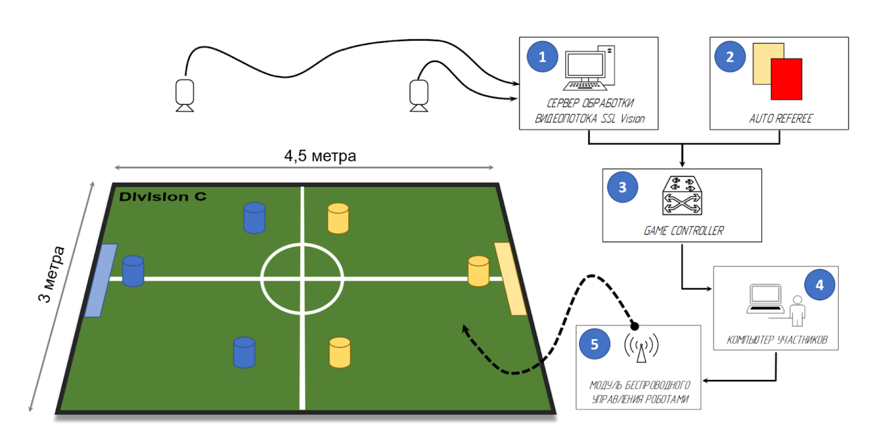

### Полезные ссылки, с которыми стоит ознакомиться:
1. [Официальный сайт](https://ssl.robocup.org/) лиги SSL, где можно найти регламенты, технические описания (TDP) роботов и алгоритмов сильных команд и многое другое
2. [Репозиторий GitHub](https://github.com/RoboCup-SSL), где находятся все программные решения, предоставляемые организаторами
3. [Сайт](https://spbunited.ru/) и [GitHub](https://github.com/SPBUnited) команды SPbUnited, а также [GitHub](https://github.com/SPBUnited-Junior) команды Eagles
4. [Регламент SSL Div. C](https://spbunited.github.io/ssl-div-c-rules/)
5. [Требования к полигону SSL Div. C](https://docs.google.com/document/d/1jFf-rv-ef6Vw0lVROEFnMGD_OXuIHW_L79-oR32_RwU/edit?usp=sharing)
6. Каналы [в Телеграмм](https://www.youtube.com/@SPbUnited.RoboCup) и [на Ютуб](https://www.youtube.com/@SPbUnited.RoboCup) о развитии SSL в России (деятельность SPbUnited и не только)

### Перечень ПО и оборудования:

##### ПО и оборудование организаторов:
ПО и оборудование, описанное в этой части создаёт всю инфраструктуру, необходимую для лиги SSL. На соревнованиях ответственность за него несут организаторы, но поскольку всё то же самое оборудование необходимо любой команде для тренирововк, то для отладки команды самостоятельно устанавливают и настраивают такие же системы.
> Инструкции по установке и запуску каждого ПО описаны в его репозитории

1. Камеры над полем - нужны для определения робота и мяча. В зависимости от размеров поля может использоваться одна или несколько камер. На начальных этапах могут использоваться обычные USB вэб-камеры ([например такие](https://www.logitech.com/en-eu/shop/p/c920s-pro-hd-webcam.960-001252)), но у них зачастую присутствуют задержки в передачи изображения и не всегда хватает длины USB проводов. Для больших полигонов обычно используются промышленные камеры, подключаемые через FireWire или Ethenet ([например такие](https://www.balluff.com/en-de/focus-topics/balluff-mv)). Для таких камер необходимо предусмотреть подключение к компьютеру с SSL-Vision с соответствующим интерфейсом.
2. Сетевое оборудование (роутер) - необходим для создания сети по которой компьютеры команд будут получать данные с оборудования организаторов.
3. [SSL-Vision](https://github.com/RoboCup-SSL/ssl-vision) - по для обработки изображения, получаемого с камер, определения там роботов и мяча. Отсюда команды получают координаты всех объектов на поле.
4. [Game controller](https:github.com/RoboCup-SSL/ssl-game-controller) - контроллер игры, управляемый человеком. Здесь главный судья запускает или останавливает игру, назначает штрафы и свободные удары и тд. Отсюда команды получают информацию о статусе игры.
5. [Status Board](https://github.com/RoboCup-SSL/ssl-status-board) (не обязательно) - ПО, создающее сайт с красивым отображением статуса игры (счёт, таймер и тд). Этот сайт можно открыт на экранах вокруг поля для наглядного отображения статуса игры.
6. [Auto referee](https://spbunited.ru/software/software/software/#:~:text=%D0%BD%D0%B0%20%D1%8D%D1%82%D0%B8%20%D0%BA%D0%BE%D0%BC%D0%B0%D0%BD%D0%B4%D1%8B-,Auto%2DReferee,-%D0%94%D0%BB%D1%8F%20%D1%83%D0%B4%D0%BE%D0%B1%D1%81%D1%82%D0%B2%D0%B0%20%D1%81%D1%83%D0%B4%D0%B5%D0%B9) (не обязательно) - автоматизированный судья. Это не обязательный компонент, но он значительно облегчает проведение матчей, автоматически определяя нарушения и назначая соответствующие действия.

Подробнее все программы описаны на [этой странице](../software/programs.md)

Всё ПО, описанное выше не предъявляет особых требований к системе, на которой запускается, поэтому для запуска может использоваться даже обычный ноутбук с Linux.

##### ПО и оборудование команд-участников:
1. Компьютер команды - кмопьютер, получающий данные о положении роботов и мяча из SSL-Vision, команды от Game Controller и рассчитывающий действия роботов команды.
2. Модуль беспроводного управления роботами - система, получающая команды от компьютера и пересылающая их на роботов по радиоканалу. Может использоваться Raspbery Pi с модулями NRF24L01.
3. Команда автономных роботов - получают команды, рассчитаные на компьютере и играют в футбол. Можно использовать открытые решения, например [роботов](https://github.com/SPBUnited-Junior/Eagles_Hardware_2024) команды Eagles. Подробные требования к роботам описаны в регламенте лиги.

## Полигон

Все требования к полигону описаны [здесь](https://docs.google.com/document/d/1jFf-rv-ef6Vw0lVROEFnMGD_OXuIHW_L79-oR32_RwU/edit?usp=sharing). 
>Стоит отметить, что у команд далеко не всегда есть возможность разложить целый полигон из-за его значительных размеров, поэтому нередко команды раскладывают лишь часть поля. Кроме уменьшения занимаемого места это также позволяет использовать меньшее количество камер. Такого решения обычно полностью хватает для отладки базового функционала роботов.

1. Покрытие: [ковролин](http://stroitelnye-materialy-v-sankt-peterburge.ru/product/14467-kovrovoe_pokryitie_tehnolayn_flort_ekspo_06017__2_m) с коротким ворсом (до 3 мм), цвет градации зелёного, возможно сращивание из двух и более отрезов ковролина. Ширина поля взята 4 метра, чтобы можно было использовать 2 куска по 2 метра. Закреплять ковролин к полу можно на двусторонний скотч, плотно проклеив стыки, так как при неровностях роботы будут за них зацепляться
2. Разметка: белая линия 10 мм. Можно нанести краской, бумажным скотчем или (ТУТ УКАЗАТЬ ТУ ТОНКУЮ ЛЕНТУ, ЕСЛИ Я ЕЕ НЕ ПРИДУМАЛА)
3. Вокруг поля должны быть установлены стенки высотой 100мм толщиной от 10мм. Все стенки должны быть чёрного цвета.
4. Ворота должны быть установлены в центре каждой линии ворот и прочно прикреплены к стенкам с помощью балок. Размер ворот 800x180мм. Ворота состоят из двух боковых стенок высотой 160 мм и задней стенки высотой 160 мм. Внутреннюю поверхность рекомендуется покрыть мягким материалом, таким как поролон или пенопласт. Внутренняя поверхность должна быть белой, а внешняя и верхняя поверхности — чёрной.
> Ворота и стенки должны выдерживать удары роботов. Наилучшим решением будет прикрутить стенки и ворота к поверхности, на которой разложен ковролин. Более простым решением является использование липучек на нижней стороне ворот и стенок. Наш опыт показывает, что этого достаточно для их фиксации на поле.

### Монтаж камер
 Обзор камер(ы) должен захватывать всё поле, а также зону аута (до стенок), чтобы робот, уехавший за поле, не пропадал из поля зрения камеры, и мог самостоятельно выехать из аута.

Камеры могут быть закреплены любым удобным способом. На соревнованиях зачастую используются фермы, подвешенные к потолку или с опорамми вокруг поля. Команда SPbUnited для вывоза в поездки использует 2 складных штатива и разборную штангу из алюминиевого профиля, закрепляемую между ними. Также камеру можно закрепить напрямую к потолку, если помещение с полигоном позволяет это сделать.
> В зависимости от угла обзора используемых камер высота их монтажа над соревновательным полигоном будет варьироваться, но обычно составляет 3-5 метров.

>Необходимо продумать доступ к камерам после их установки на необходимую высоту. Это нужно для точной подгонки направления камеры и ручной настройки фокуса, если используемая камера ей обладает.