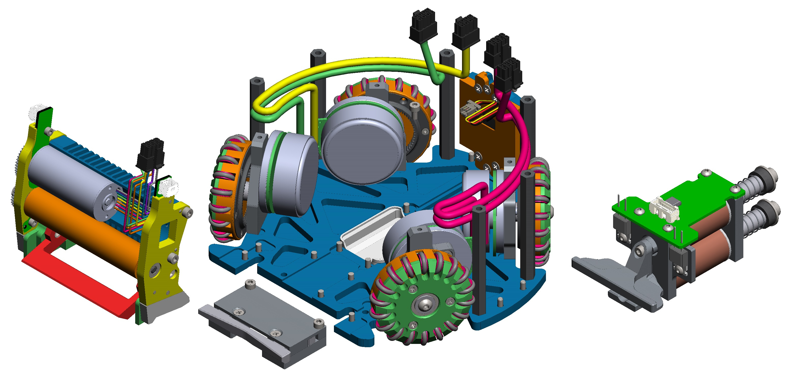
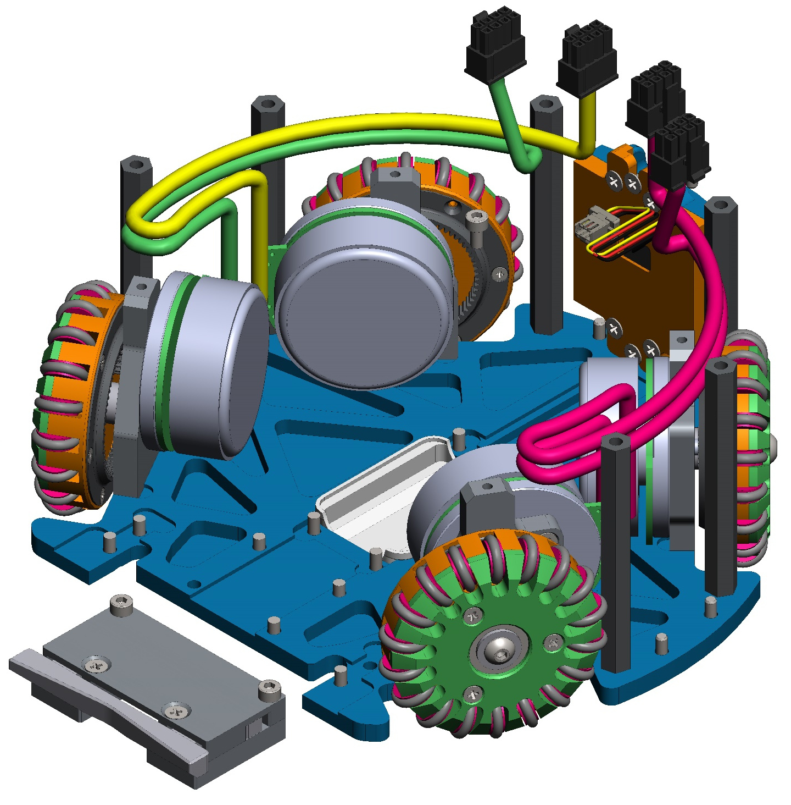
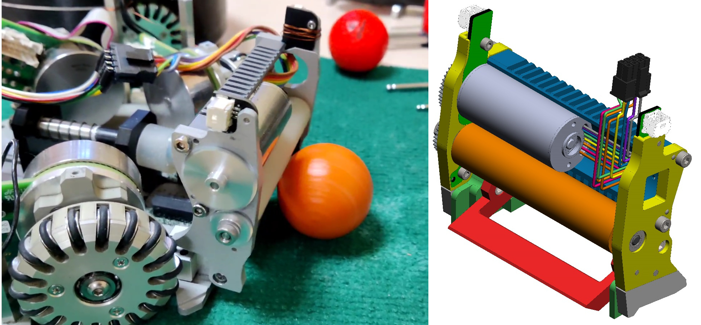
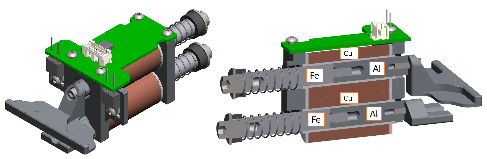

#Конструкция

Конструкцию робота можно разделить на несколько частей: дрибблер, демпфер, платформа и кикер

##Платформа

На платформе располагаются 4 БДПТ, снабженных омниколесами на собственных подшипниковых узлах с одноступенчатым редуктором. Это позволяет роботу перемещаться в любом направлении

##Демпфер

Демпфер размещается под дрибблером и используется для того, чтобы ловить мячи, полученные на большой скорости

##Дрибблер

В состав дрибблера входит БДПТ с мультипликатором, вращающий мяч, и датчик наличия мяча

##Кикер

Два соленоида с подвижными сердечниками позволяют совершать удары по прямой или навесом