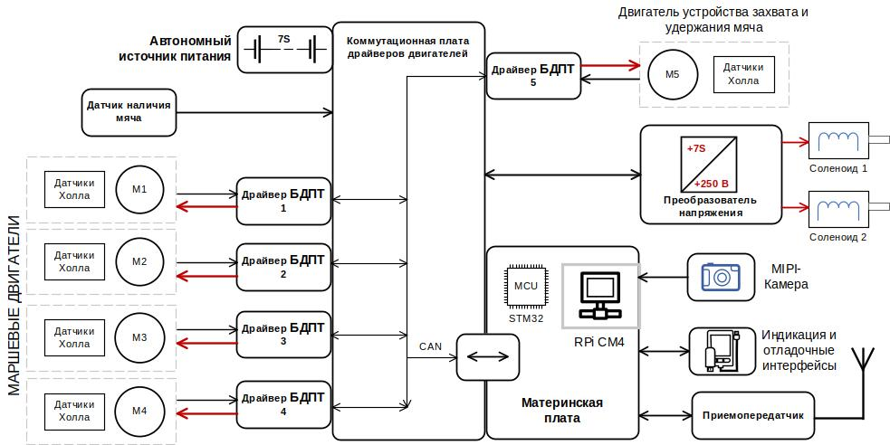
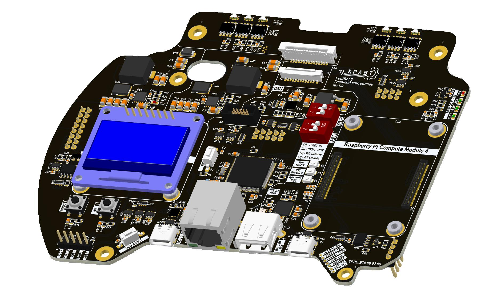
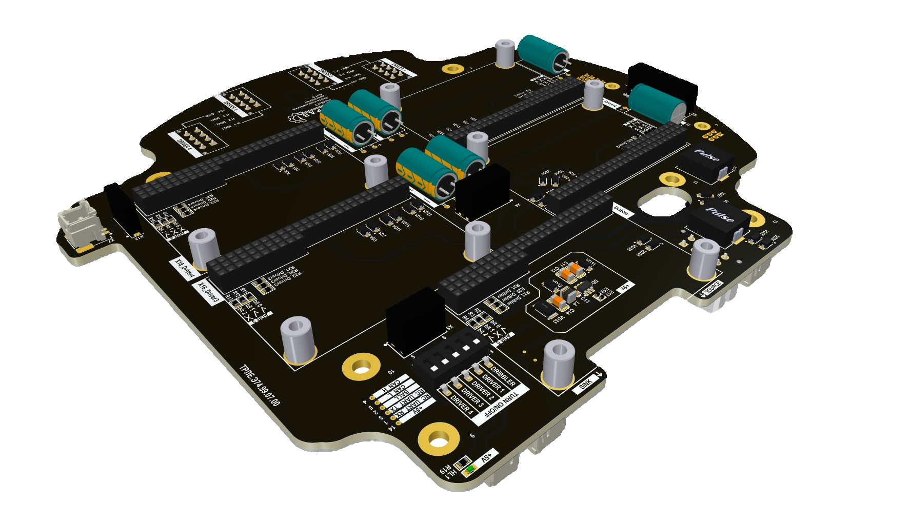
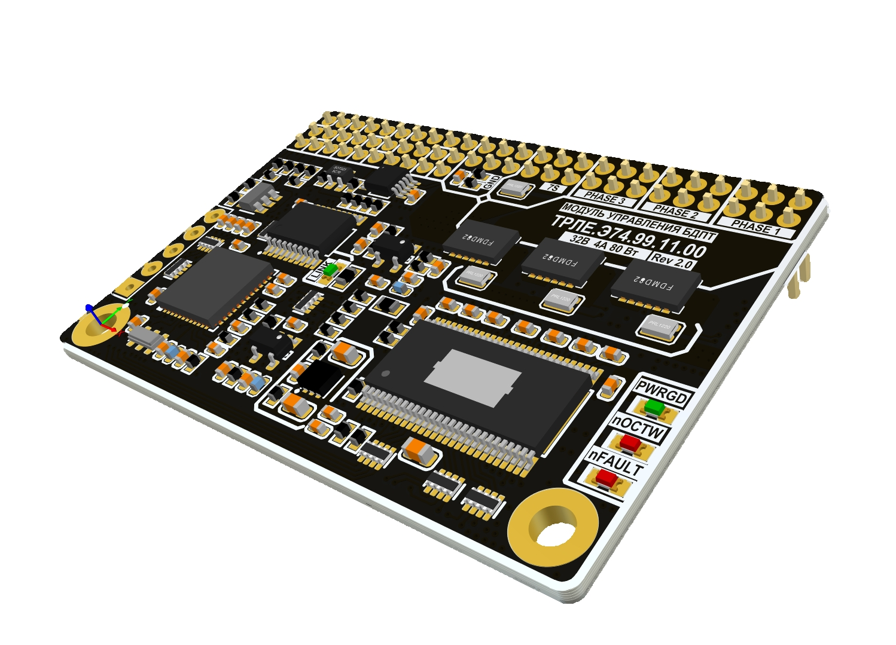
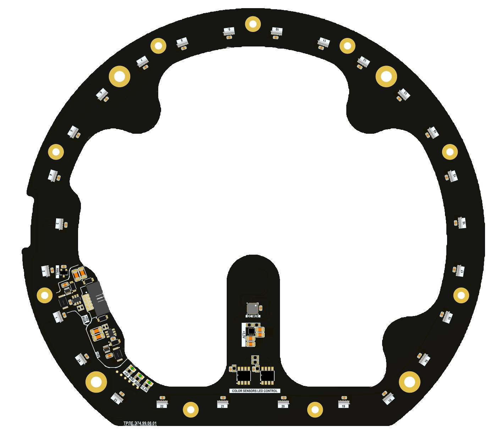
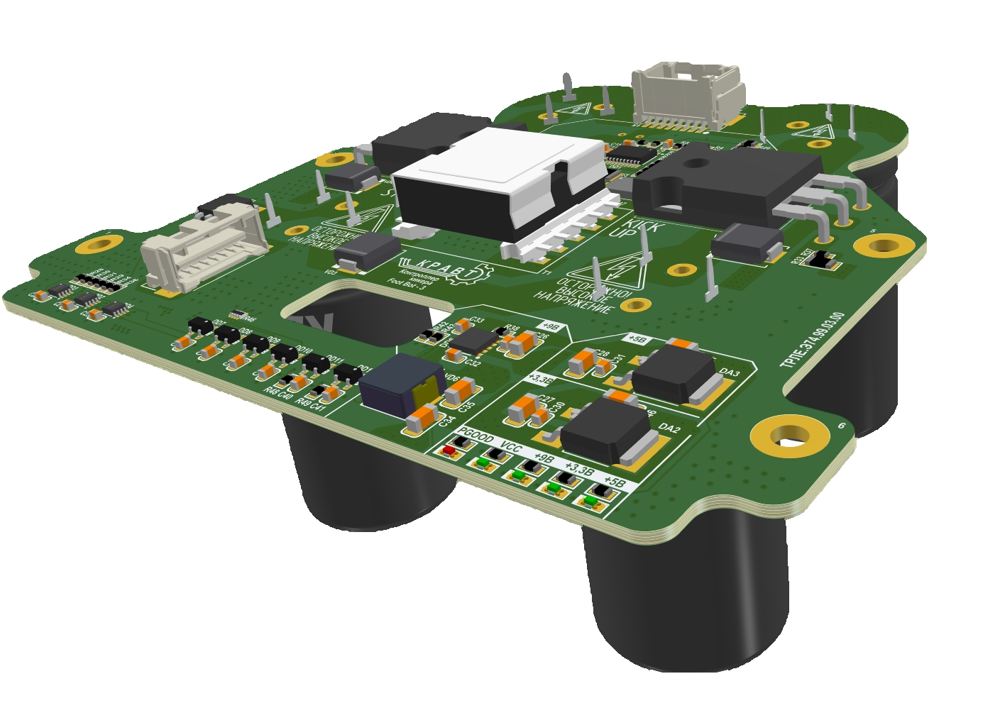
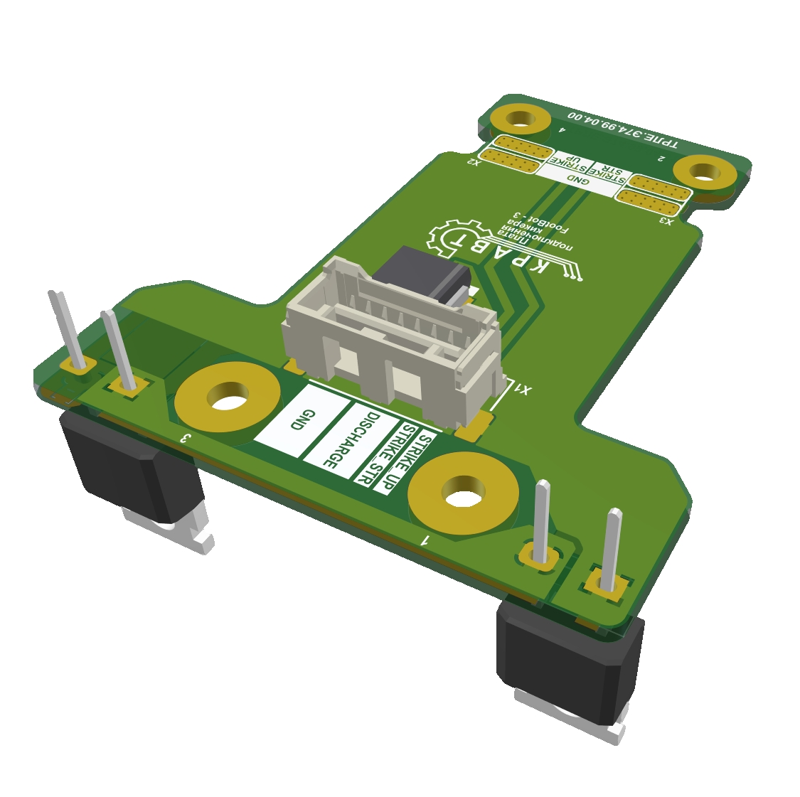

# Архитектура электроники

Вся электроника делится на две части: Блок электроники и Платформу

# Блок электроники
## Материнская плата

- Сверху у материнской платы есть разъём для подключения 2 камер по интерфейсу *MIPI CSI-2/4*
- Слева дисплей для индикации состояния электроники
- Справа одноплатный компьютер *Raspberry Pi 4 Compute Module*, который может быть использован для:
    - Распознавания мяча и позиционирования
    - Использования *ROS*
    - Подключение периферии по USB
- Снизу располагаются разъёмы для отладки и подключения периферии

## Управление двигателями
#### Коммутационная плата подключения двигателей

На плате подключения двигателей находятся 5 разъёмов подключения модулей управления **Бесколлекторными Двигателями Постоянного Тока**  (4 отвечающих за маршевые двигатели и 1 управляющий двигателем дрибблера). Также на плате располагаются разъёмы для подключения датчика наличия мяча в дрибблере

#### Модуль управления двигателем БДПТ

Характеристики модуля управления БДПТ:

- Максимальная мощность двигателя: 80 Вт
- Режим управления по энкодеру и датчикам холла
- Связь по шине *CAN*
- Аппаратная установка адреса. Доступное количество адресов: 8

## Плата датчика определения цвета меток адреса робота

Прямо под крышкой робота находится плата, считывающая цвета меток, для автоматического определения индекса. Также на плате присутствует круговая подсветка, позволяющая отслеживать состояние робота.

<!-- ##Автономный источник питания -->
# Платформа
## Плата повышающего преобразователя напряжения

Повышает напряжение с *24 В* до *300 В*. Управление двумя соленоидами, обеспечивающими удары двух типов: вверх и вперед.

Дополнительная коммутационная плата обеспечивает подключение двух соленоидов и нагрузочных резисторов для регулирования силы удара путем разрядки конденсаторов

## Коммутационная плата подключения соленоидов

Плата обеспечивает подключение двух соленоидов и нагрузочных резисторов для регулирования силы удара путем разрядки конденсаторов

<!-- ##Светодиодная матрица -->