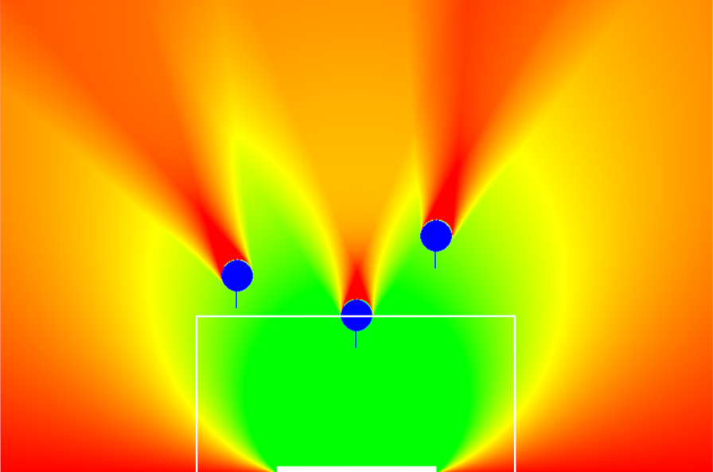

#Алгоритмы
Ниже кратко описаны самые интересные алгоритмы, разработанные нами.

##[Bang-bang траектории](./bang_bang/bang_bang.md)
Для оптимального движения робота, необходимо разработать алгоритм, строящий оптимальную по времени траекторию.
[Репозиторий с реализацией](https://github.com/SPBUnited/strategy/tree/bang-bang-path)

##Тепловые карты для пасов
Мы используем тепловые карты для визуализации на поле зон, в которые удобно давать пас. 
[Репозиторий с реализацией](https://github.com/SPBUnited/strategy/tree/explore_best_pass)
 
