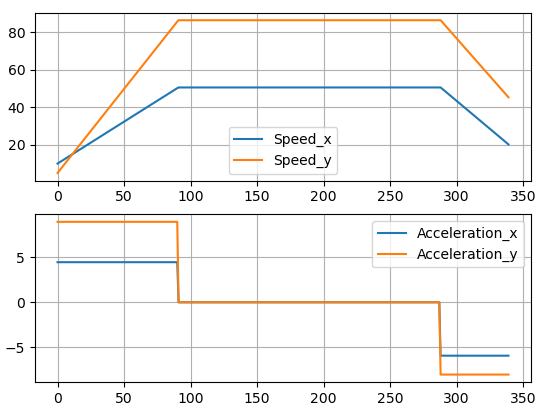
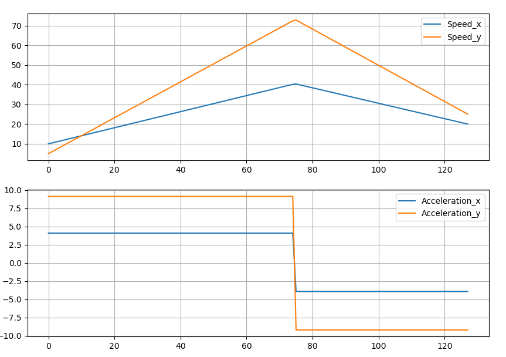

# Построение "Bang-bang" траекторий движения между двумя точками для футбола роботов

>***Bang-bang*** (англ. "двухпозиционная") *траектория* - траектория, во время движения по которой вектор ускорения имеет два возможных значения

## 1. Длинные траектории, случай "Призма"
Название обусловлено видом графика зависимости проекций скорости на координатные оси от времени

Как мы видим, обе проекции скорости на оси меняются одновременно

### 1.1 Постановка задачи
Робот сначала разгоняется c начальной скорости \(\vec v_1\) до максимальной скорости \(v\) с ускорением \(\vec a_1\) за время \(t_1\), после едет с максимальной скоростью \(\vec v\) время \(t\) и тормозит с ускорением \(\vec a_2\) за время \(t_2\) до конечной скорости \(\vec v_2\). За всё движение робот перемещается на \(\Delta \vec r\).

* Дано: \(a_m\) (модуль максимального ускорения), \(v_m\) (модуль максимальной скорости), \(\vec v_1, \vec v_2, \Delta \vec r\) 
* Найти: \(\vec a_1, \vec a_2, \vec v\) (восстановить, зная модули), \(t\)

### 1.2 Реализация
 

Красные участки - разгон; синий участок - постоянная скорость; фиолетовые точки - начало и конец.

Поиск будем производить "вращая" вектор \(v\). Остальные неизвестные восстановим из формул (аналогично для \(t_2, \vec a_2\)):
$$\vec a_1 = (\vec v - \vec v_1) * t_1$$
$$t_1 = \frac{a_m}{|\vec v - \vec v_1|}$$
$$\vec a_1 = a_m * \frac{\vec v - \vec v_1}{|\vec v - \vec v_1|}$$
$$t = \frac{|\Delta \vec r - (\vec v_1 + \vec v) * t_1 / 2 - (\vec v_2 + \vec v) * t_2 / 2|}{v_m}$$

Для получения \(t\) разделим длину прямого участка (всё перемещение \(\Delta \vec r\) без перемещения при разгоне/торможении) на скорость его прохождения

Направление вектора \(v\) находим *троичным поиском (он же тернарный)*. Для этого строим траекторию используя промежуточное значение \(v\), и считаем расстояние от конца получившейся траектории до необходимой конечной точки. Именно это расстояние мы будем стремиться минимизировать.

$$(\vec v_1 + \vec v)*t_1/2 + \vec v*t + (\vec v_2+\vec v)*t_2/2 \to \Delta \vec r$$

Переберём 10 значений и вокруг минимального из них будем искать 0. Это необходимо для того, чтобы троичный поиск не остался в локальном минимуме. Троичный поиск ведём до тех пор, пока промежуток возможного угла не окажется малым (ожидание зануления расстояния может спровоцировать бесконечный цикл)

### 1.3 Анализ ответа
Если конечное расстояние оказалось малым, то траектория найдена и мы можем смело возвращать её роботу или выводить на экран. Если же расстояние явно показывает, что траекторию построить не удалось, то на это есть две причины:

* траектория с достижением максимальной скорости существует, но мы не смогли её обнаружить
* такую траекторию построить невозможно, то есть общее перемещение робота мало и у нас нет возможности разогнаться до максимальной скорости

**Первый случай** скучный, нужно лишь перезапустить алгоритм, увеличив количество перебираемый значений перед троичным поиском. Пока не будем тратить на него время работы программы и перезапустим код в случае если не удастся найти путь другими методами тоже. **Второй случай** уже требует новый алгоритм для создания траекторий, который мы рассмотрим далее

## 2. Короткие траектории, случай "Треугольник"
На этот раз название вновь связано с видом графика зависимости проекций скорости на координатные оси от времени

На этот раз на графике нет прямого участка из-за того, что робот не успевает разогнаться до максимальной скорости.

### 2.1 Постановка задачи
 
 Робот разгоняется c начальной скорости \(\vec v_1\) до некоторой скорости \(v\) с ускорением \(\vec a_1\) за время \(t_1\) и сразу тормозит с ускорением \(\vec a_2\) за время \(t_2\) до конечной скорости \(\vec v_2\). За всё движение робот также перемещается на \(\Delta \vec r\).

* Дано: \(a_m\) (модуль максимального ускорения), \(\vec v_1, \vec v_2, \Delta \vec r\) 
* Найти: \(\vec a_1, \vec a_2\) (восстановить, зная модули) и \(\vec v\)

Задача усложнилась с предыдущего случая тем, что теперь мы не знаем модуль промежуточной скорости. 

### 2.2 Реализация
.gif) 

Перебор угла для заданного модуля скорости. Красные участки - разгон; фиолетовые точки - начало и конец.

Поиск будем производить не только "вращая" вектор \(v\), но и перебирая модуль его скорости. Ускорения и время восстановим из вышеописанных формул (см. п. 1.2)

Будем перебирать модуль \(\vec v\) и отдавать его тому же алгоритму, что считал расстояние до цели для "трапеции"

Для поиска модуля также перебираем 10 значений на промежутке \([0, v_m]\) и выполняем поиск вокруг наименьшего

### 2.3 Анализ ответа
В случае нахождения пути заканчиваем алгоритм, но если путь не нашёлся, то вновь возвращаемся к двум случаям
* траектория без достижения максимальной скорости существует, но мы не смогли её обнаружить
* такую траекторию построить невозможно, то есть алгоритм с достижением максимальной скорости должен был построить маршрут

В обоих случаях нам необходимо прогнать оба алгоритма ещё раз, но рассматривая больше значений в начале, чтобы точно найти значение около минимума, которое явно будет меньше остальных.

## 3. Увеличение дискретизации перед троичным поиском

Для увеличения числа значений, которые мы будем перебирать перед троичным поиском будем передавать их число \(n\) в качестве параметра функции. Если после первого прогона оба алгоритма для длинных и коротких траекторий не смогли найти траекторию, запустим первый из них увеличив \(n\) на 10. Так алгоритмы смогут сделать ещё один пробег и найти маршрут. Больше двух раз прогонять все эти ресурсозатратные алгоритмы не имеет смысла, поэтому возвращаем <code>None</code>

Важно отметить, что это является решением проблемы невозможности построить путь, поэтому об оптимальности речи не идет. 

<!-- ## 4. Примеры других команд
В нашей реализации меняется именно вектор ускорения, а не его проекция на оси. Это увеличивает количество вычислений, но уменьшает время прохождения по полученной траектории. Также при пересчёте траектории во время движения по ней, она не изменится, так как является оптимальной для такой реализации.
 
 TODO Добавить примеры других команд -->