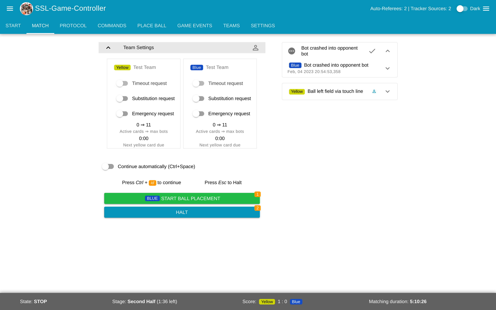
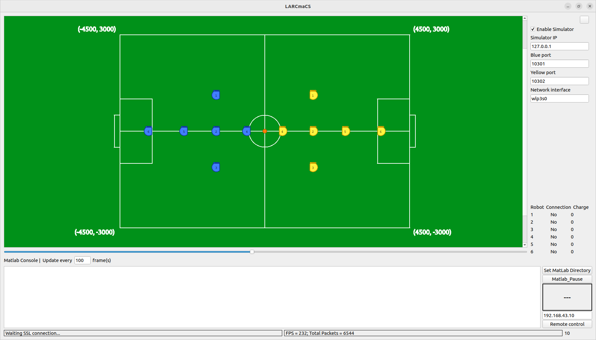

#Общедоступные программы

Целью лиги *RoboCup SSL* является распространение разработок, поэтому существует множество программ, созданных сообществом лиги (посмотреть полный список можно [здесь](https://ssl.robocup.org/league-software/)). Все программы взаимодействуют в одной локальной сети, передавая пакеты по протоколу *Google Protocol Buffers* ([подробнее](https://ssl.robocup.org/league-software/#:~:text=Simulation%20Protocol.-,Standard%20Network%20Parameters,-Protocol)) Ниже представлены программы, которые мы активно используем и их описание

##SSL-Vision

[SSL Vision](https://github.com/RoboCup-SSL/ssl-vision) - программа для получения координат роботов и мяча на поле и передачи их в локальную сеть

##GrSim

[GrSim](https://github.com/RoboCup-SSL/grSim) - симулятор для лиги *RoboCup SSL*. Заменяет систему для распознавания роботов и самих роботов, что позволяет отлаживать тактику в пределах одного устройства

##SSL-Game-Controller

[SSL Game Controller](https://github.com/RoboCup-SSL/ssl-game-controller) - инструмент для судей на соревнованиях. Он позволяет отправлять командам информацию о состоянии игры (штрафной, пенальти, остановки и т.д.). Роботы команд обязаны реагировать на эти команды

###Auto-Referee
Для удобства судей и честностью проведения соревнований, существуют автоматические системы судейства. Они не только помогают с определением нарушений человеческому судье, но и выявляют такие нарушения, которые человеческий судья не может зафиксировать (превышение скорости мяча или робота, задержка мяча и прочие). Для комфортной отладки можно полностью поручить судейство автоматическому судье, который также будет переключать состояния игры, вести счёт, следить за временем, выдавать карточки и так далее. 
Активно используются два авто-судьи, от немецких команд [TIGERs-Mannheim](https://github.com/TIGERs-Mannheim/AutoReferee) и [ER-Force](https://github.com/robotics-erlangen/autoref). Эти программы также могут работать одновременно

###SSL Status Board

[SSL Status Board](https://github.com/RoboCup-SSL/ssl-status-board-client) - удобная программа для вывода счета, времени, штрафных карточек и прочей информации на экран. Используется на всех соревнованиях для привлечения зрителей. Дополнительно можно настроить названия и эмблемы команд

Также есть интересная программа [*AudioRef*](https://gitlab.tigers-mannheim.de/open-source/audioref), озвучивающая все действия судьи (выдача карточек, остановка роботов, назначение пенальти и т. п.)

#Программы нашей разработки

##LARCmaCS

*LARCmaCS* - компонент, написанный на *С++*, который занимается получением пакетов с информацией об игре от организаторов и передаёт её компоненту *strategy-bridge* для синтеза управления. Далее *LARCmaCS* осуществляет передачу полученных от *strategy-bridge* управляющих команд на самих роботов. Таким образом, *LARCmaCS* отвечает за все низкоуровневое взаимодействие, инкапсулируя его от разработчиков стратегии. Помимо этого, *LARCmaCS* предоставляет пользователю графический интерфейс пользователя

##Strategy-bridge

С целью предоставления для разработчиков инструментов для высокоуровневого описания стратегии был реализован компонент, названный *strategy-bridge* (далее «бридж»), написанный на языке *Python*. Основная абстракция бриджа - это процессор, представляющий собой вычислительную единицу, осуществляющую заданные пользователем действия в бесконечном цикле с настраиваемым шагом дискретизации. Например, может быть процессор, который потребляет пакеты *SSL-Vision* от *LARCmaCS* и предобрабатывает их или процессор, который отправляет результирующие управляющие сигналы на *LARCmaCS* с целью отправки их роботам. Каждый процессор может потреблять данные, которые были созданы другими процессорами и делиться своими собственными. Были реализованы шаблоны процессоров, которые позволяют вызывать код написанный на языке *MATLAB*, часто используемым исследователями в области теории управления. Результирующие управляющие сигналы публикуются в топике *ZeroMQ* с использованием библиотеки pyzmq для последующего использования модулем связи с роботом

Все данные, которые должны быть поделены между различными процессорами проходят через структуру в памяти, называемую «шиной данных» (*data bus*). Все хранимые данные разбиваются на топики, где каждый топик представляет собой очередь ограниченного размера. Пользователь может настраивать размер каждого конкретного топика. Когда топик достигает предельного размера, происходит вытеснение старых данных

Каждый процессор может писать в один или несколько топиков, принадлежащих ему, а также читать из любых других топиков.

Было реализовано несколько режимов работы процессоров: с помощью асинхронных задач и библиотеки *asyncio*, а также в режиме многопроцессорности, где каждый процессор выполняется на отдельном процессе операционной системы. Выбор того или иного режима должен быть обусловлен ресурсами сервера, на котором происходит синтез управления, количества процессоров, которые должны выполняться одновременно, времени исполнения одного шага вычислений процессора, а также допустимыми задержками. Также имеет значение объем данных, который пишется и читается процессорами, поскольку в случае многопроцессорного режима происходит передача информации между различными процессами, занимающая больше времени чем передача информации внутри одного процесса.